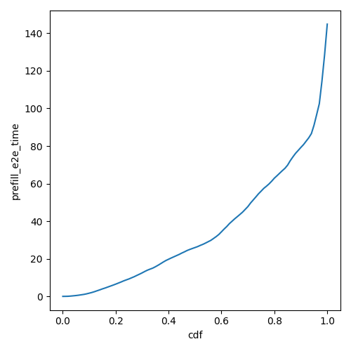
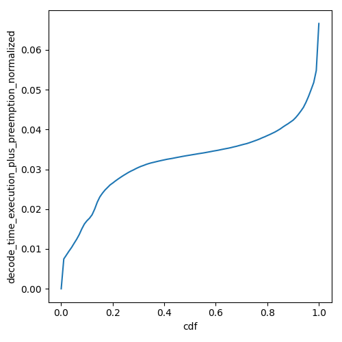
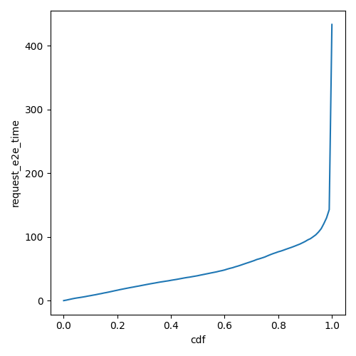
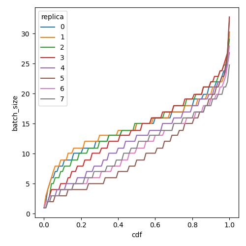

# Vidur: LLM Inference System Simulator

Vidur is a high-fidelity and extensible LLM inference system simulator. It can help you with:

1. Study the system performance of models under different workloads and configurations.

    | TTFT | TPOT | Request E2E Time | Batch Size |
    | --- | --- | --- | --- |
    |  |  |  |  |

    *`Llama-3-8B` running the [AzureLLMInferenceTrace2023_conv](https://github.com/Azure/AzurePublicDataset/blob/master/data/AzureLLMInferenceTrace_conv.csv) trace on single `A100 80GB` at 6.45 QPS*

1. Capacity planning and finding the best deployment configuration for your LLM deployments.
   
*Capacity per dollar for different deployment configurations vs TTFT-P90 and TBT-P99 for LLaMA2-70B.*
1. Quickly test new research ideas like new scheduling algorithms, optimizations like speculative decoding, etc.

... all without access to GPUs except for a quick initial profiling phase 🎉. We highly recommend checking out our [MLSys'24 paper](https://arxiv.org/abs/2405.05465) and [talk](https://mlsys.org/virtual/2024/poster/2667) for more details.


## Supported Models

| Model / Device | H100 DGX | A100 80GB DGX | 4xA100 80GB Pairwise NVLink Node | 8xA40 Pairwise NVLink Node |
| --- | --- | --- | --- | --- |
| `meta-llama/Meta-Llama-3-8B` | ✅ | ✅ | ✅ | ❌ |
| `meta-llama/Meta-Llama-3-70B` | ✅ | ✅ | ✅ | ❌ |
| `meta-llama/Llama-2-7b-hf` | ✅ | ✅ | ✅ | ✅ |
| `codellama/CodeLlama-34b-Instruct-hf"` | ✅ | ✅ | ✅ | ✅ |
| `meta-llama/Llama-2-70b-hf` | ✅ | ✅ | ✅ | ✅ |
| `internlm/internlm-20b` | ✅ | ✅ | ✅ | ✅ |
| `Qwen/Qwen-72B` | ✅ | ✅ | ✅ | ✅ |

* __Instructions on adding a new model to existing or new SKUs can be found [here](docs/profiling.md)__.
* All models support a maximum context length of 4k except `Llama3-8B` and `Llama3-70B` which support 16k context length.
* Pipeline parallelism is supported for all models. The PP dimension should divide the number of layers in the model.
* In DGX nodes, there are 8 GPUs, fully connected via NVLink. So TP1, TP2, TP4 and TP8 are supported.
* In 4x pairwise NVLink nodes, there are 4 GPUs, so TP1, TP2 and TP4 are supported. TP4 here is less performant than TP4 in DGX nodes because (GPU1, GPU2) are connected via NVLink and (GPU3, GPU4) are connected via NVLink. but between these layers, the interconnect is slower.
* You can use any combination of TP and PP. For example, you can run LLaMA2-70B on TP2-PP2 on a 4xA100 80GB Pairwise NVLink Node.

## Setup (using `uv`)

1. Install [uv](https://docs.astral.sh/uv/getting-started/installation/#installation-methods)
2. At project root, run `uv venv` to create a new virtual environment.
3. Activate the environment using `source .venv/bin/activate`.
4. Install dependencies using `uv sync`. The environment is now ready for use.

## Setting up wandb (Optional)

First, setup your account on `https://<your-org>.wandb.io/` or public wandb, obtain the api key and then run the following command,

```sh
wandb login --host https://<your-org>.wandb.io
```

To opt out of wandb, set `export WANDB_MODE=disabled` in your shell or add this in `~/.zshrc` or `~/.bashrc`. Remember to reload using `source ~/.zshrc` or `source ~/.bashrc`.

## Running the simulator

To run the simulator, execute the following command from the repository root:

```sh
python -m vidur.main \
--time_limit 10800 \
--replica_config_model_name meta-llama/Meta-Llama-3-8B \
--replica_config_device h100 \
--replica_config_network_device h100_dgx \
--cluster_config_num_replicas 8 \
--replica_config_tensor_parallel_size 1 \
--replica_config_num_pipeline_stages 1 \
--request_generator_config_type synthetic \
--synthetic_request_generator_config_num_requests 128 \
--length_generator_config_type trace \
--trace_request_length_generator_config_trace_file ./data/processed_traces/mooncake_conversation_trace.csv \
--interval_generator_config_type poisson \
--poisson_request_interval_generator_config_qps 8.0 \
--global_scheduler_config_type round_robin \
--replica_scheduler_config_type vllm_v1 \
--vllm_v1_scheduler_config_chunk_size 512 \
--vllm_v1_scheduler_config_batch_size_cap 512 \
--cache_config_enable_prefix_caching
```

The command above simulates a scenario with a H100 DGX node running 8 replicas of the `Meta-Llama-3-8B` model, with synthetic requests generated at a QPS of 8. The `mooncake_conversation` trace file is used for request lengths, and the scheduler is set to `vllm_v1` which has been taken from the [vLLM V1](https://github.com/vllm-project/vllm/blob/main/vllm/v1/core/sched/scheduler.py).

__The simulator supports a plethora of parameters for different simulation scenarios, see [docs/how_to_run.md](docs/how_to_run.md). Also run `python -m vidur.main -n` to get helptext on all parameters.__

## Simulator Output

* The metrics will be logged to wandb directly and a copy will be stored in the `simulator_output/<TIMESTAMP>` directory. __A description of all the logged metrics can be found [here](docs/metrics.md).__
* Vidur exports chrome traces of each simulation. The trace can be found in the `simulator_output` directory. The trace can be opened by navigating to `chrome://tracing/` or `edge://tracing/` and loading the trace.

    

## Formatting Code

To format code, execute the following command:

```sh
make format
```

## Contributing

This project welcomes contributions and suggestions.  Most contributions require you to agree to a
Contributor License Agreement (CLA) declaring that you have the right to, and actually do, grant us
the rights to use your contribution. For details, visit https://cla.opensource.microsoft.com.

When you submit a pull request, a CLA bot will automatically determine whether you need to provide
a CLA and decorate the PR appropriately (e.g., status check, comment). Simply follow the instructions
provided by the bot. You will only need to do this once across all repos using our CLA.

This project has adopted the [Microsoft Open Source Code of Conduct](https://opensource.microsoft.com/codeofconduct/).
For more information see the [Code of Conduct FAQ](https://opensource.microsoft.com/codeofconduct/faq/) or
contact [opencode@microsoft.com](mailto:opencode@microsoft.com) with any additional questions or comments.

## Trademarks

This project may contain trademarks or logos for projects, products, or services. Authorized use of Microsoft 
trademarks or logos is subject to and must follow 
[Microsoft's Trademark & Brand Guidelines](https://www.microsoft.com/en-us/legal/intellectualproperty/trademarks/usage/general).
Use of Microsoft trademarks or logos in modified versions of this project must not cause confusion or imply Microsoft sponsorship.
Any use of third-party trademarks or logos are subject to those third-party's policies.
